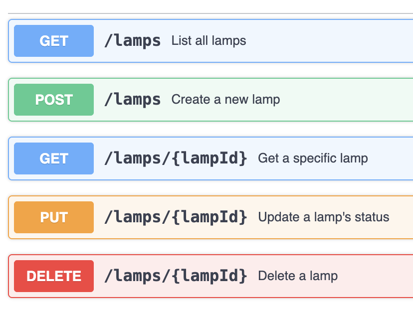

# Why could PHP and Java disappear?

While it's easy to prefer one language over another and argue about how much better it is to rewrite something in another language or framework, it's harder to provide evidence. I have been there, and have said stuff like “If we rewrite this in [insert here your preferred language], it will be easier/faster/more productive”.

I've always wanted to be able to compare real implementations, not just "hello world" examples, so I chose to compare 7 languages 🤯: TypeScript, Python, C#, Java, PHP, Go, and Kotlin.

But how to compare them?

My idea was to create a simple CRUD on OpenAPI and see how to implement it using each language.

For each one, I selected the framework that supported REST/JSON implementation, and from all the available ones, I chose the most popular one. I’m sure there is some lib/framework out there that is more optimized than the one I picked, but I wanted the most broadly adopted framework to understand the current tech panorama.

I started in April, so the stack might be a slightly outdated ⏳.

| Language   | Version | Runtime    | Framework    |
|------------|---------|------------|--------------|
| TypeScript | 5.8     | Node 22    | Fastify      |
| Python     | 3.12    |            | FastAPI      |
| C#         | 12      | .NET 8     | ASP.NET Core |
| Java       | 21      | Temurin 21 | Spring Boot  |
| PHP        | 8.3     |            | Slim         |
| Go         | 1.24    |            | Chi          |
| Kotlin     | 2.1     | Temurin 21 | Ktor         |

I started by writing the OpenAPI definition (API-First Approach) and then searched for the most idiomatic way to generate and implement it in each language. I chose to implement the backend in memory without a database. While this does not leverage SQL functionality, I wanted a simple example that had a minimal abstraction in the codebase between the “controller” and the “storage”.

My first goal was to understand which language needed less code to do that. The larger the codebase, the harder it is to maintain. The language that needs more code to get to the same output will require bigger PRs, more code to read, more code to refactor, and more code to scan for vulnerabilities. And now, in a world where every IDE has AI agents integrated, the fewer tokens to send to the LLM, the better.

We all know that some languages perform better in certain situations, but all of them are used to write REST/JSON APIs. I used an example object "Lamp", with a status that can be ON or OFF, and I limited the scope to 5 endpoints: Create, Update, Delete, Get, and List.



Let’s guesstimate and say it will take any of these languages around 200 lines of code to implement this. I’m sure  I’m underestimating this by a 2x factor (so 400) while thinking mostly of the happy path.  I don’t want to compare just the developer experience, build time, CI time, or execution time just yet. I could go into more detail about that in a future blog post.

After setting up the project for each language and generating server code based on the same OpenAPI definition, I wanted to ensure they implemented the same thing. I added unit tests and E2E tests. I wanted to be sure that all implementations complied with the specs, so I added [Schemathesis](https://github.com/schemathesis/schemathesis) testing.

## Language Features

Before even looking at the results, we need to acknowledge that there are some languages that are more expressive and/or concise than others. Let’s have a quick look at Typescript and PHP: 

Typescript

```tsx
export interface LampEntity {
  id: string;
  status: boolean;
  createdAt: string;
  updatedAt: string;
}

export type LampEntityCreate = Omit<LampEntity, 'id' | 'createdAt' | 'updatedAt'>;

export type LampEntityUpdate = Partial<LampEntityCreate>;
```

PHP

```php
class LampEntity
{
    public function __construct(
        public string $id,
        public bool $status,
        public string $createdAt,
        public string $updatedAt
    ) {}
}

class LampEntityCreate
{
    public function __construct(
        public bool $status
    ) {}
}

class LampEntityUpdate
{
    public function __construct(
        public ?bool $status = null
    ) {}
}
```

This not only demonstrates that TypeScript is more concise when writing similar code, requiring fewer lines to achieve the same behavior, but also much more expressive. It allows me to express a type-based relationship. If I want to add more fields to my LampEntity, like `brightness`, it would not require changes to the TypeScript implementation of LampEntityCreate and LampEntityUpdate, but it would increase in any other language.

## Implementation in numbers


**S Tier** - (500 lines for the App and 500 lines for tests):

- **TypeScript** and **Python**: popular and concise.
- **C#**: the champion of the .NET world, especially in enterprise.

**A Tier** 

- **Kotlin** (600 lines): Kotlin is the winner of the JVM, offering the same functionality for almost half of the code.

**B Tier**

- **Go** (800 lines): uses a lot of generated code with mocks and input validation. If it were only based on the amount of code to implement by hand, it would be on **S Tier,** like Typescript. It really depends on your taste in what you consider code to maintain.

**C Tier**

- **Java** (1000 lines): could be optimized with the Record pattern or Lombok, but it’s not the experience out of the box.
- **PHP** (>1000 lines): similar to Java, the Constructor Property Promotion might reduce the boilerplate, but not yet in the flow of the generator.

### [***Don't repeat yourself*** (DRY)](https://www.google.es/books/edition/The_Pragmatic_Programmer/5wBQEp6ruIAC?hl=en&gbpv=1&pg=PA27&printsec=frontcover&dq=dry) vs [**A little copying is better than a little dependency**](https://www.youtube.com/watch?v=PAAkCSZUG1c&t=9m28s)

Another metric that we can use to compare languages is their [DRYness](https://github.com/boyter/scc?tab=readme-ov-file#unique-lines-of-code-uloc)  ****🌵. How many lines do you repeat in your code? This should be counterbalanced by coupling your code; you sometimes want a bit of repetition(looking at you [is-number](https://www.npmjs.com/package/is-number) 👀)  instead of depending on another function or package. 

So, regardless of the size of the solution, how often are you writing the same line(this includes brackets, imports, if, …):

**S Tier** - (45% of Lines are unique):

- **TypeScript** and **Kotlin**

**A Tier**  - (40–44% of Lines are unique):

- **Python**, **Go** and **C#**

**B Tier**  - (35–39% of Lines are unique):

- **Java** and **PHP**

## Where to go from here?

While I don’t think PHP is going to be replaced tomorrow, it certainly won't be picked up for new projects, and we are already seeing trends of big projects and companies using TS/JS or Go for new backends.

For Kotlin, while it’s showing a slower adoption than I thought it would have when I discovered it 10 years ago, it’s still a winner on the JVM; it forced Java's hand by actively reducing boilerplate in recent versions. Would future backends leave Java or the JVM entirely? Only enterprise adoption will tell.

If you want to dig deeper into each implementation, go and look at the repository:

https://github.com/davideme/lamp-control-api-reference

In the future, I will explore other aspects, like going beyond the MVP or the readiness to put it in production. Would this conclusion still hold true when :

- Integrating a database?
- Adding observability?
- Implementing more complex systems (Pub/Sub, Webhooks, ...)?

And also, we could explore other aspects like:

- Language expressiveness and safety (error management or null handling)
- Performance
- Ecosystem maturity and library availability
- Developer experience, team expertise, and hiring pool
- Long-term maintenance costs
- Enterprise requirements and existing codebases
- Deployment complexity

Additional Considerations:

**Why Typescript and not JavaScript?** For backend purposes, since July 2025, they are mostly equivalent in terms of what we evaluated; only a small subset of features still requires transformation (like enum or parameter properties), but in terms of the amount of code produced, they are similar, so either of them would have produced the same result. 

For **PHP,** I initially tried with Laravel, but the codebase when initializing the project is even bigger than Slim.