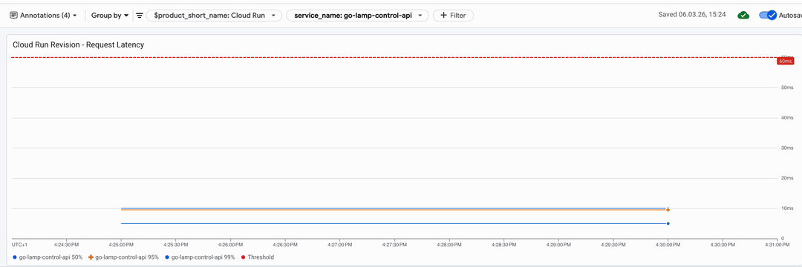
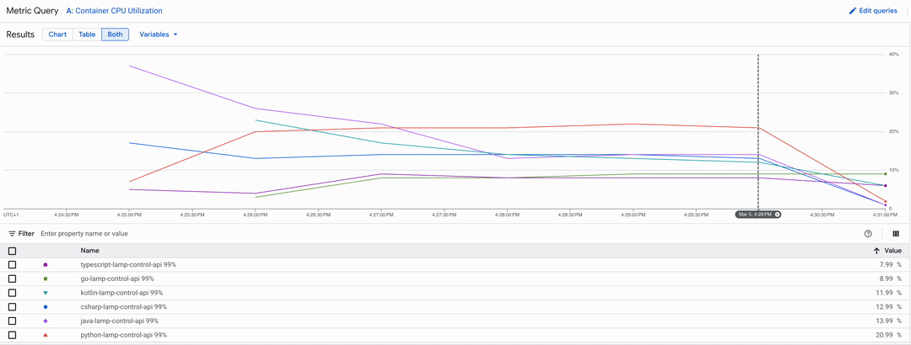

Some assumptions get repeated so often they stop feeling like opinions and start feeling like facts. I wanted to put some to the test regarding Backend Performance(Latency + Throughput).

## 🏎️ Latency

Assumption: "Native code is _faster_ than Interpreted code", But is it faster in any things that matter?

My test case for latency is to benchmark 6 language with a simple REST API, for more details about the implementation have a look at [REST API and in memory implementation](crud-openapi).

| Language       | Compiled To  | When Compilation Happens | Execution Model   |
| -------------- | ------------ | ------------------------ | ----------------- |
| **TypeScript** | Bytecode     | At runtime               | Interpreter + JIT |
| **Python**     | Bytecode     | At runtime               | Interpreter       |
| **Java**       | Bytecode     | Build time               | Interpreter + JIT |
| **C#**         | Bytecode     | Build time               | Interpreter + JIT |
| **Go**         | Machine code | Build time               | Direct execution  |
| **Kotlin**     | Bytecode     | Build time               | Interpreter + JIT |

I would say the general assumption of the podium would be:

1. Machine code: Go
2. Bytecode at Build time: Java, Kotlin, C#
3. Bytecode at Runtime: Javascript, Python

What about **JIT compilation**? Java, Kotlin, C#, and [^4]TypeScript all use just-in-time compilers that compile bytecode to machine code at runtime, will this influence the results?
Assumption: Might be noticeable at the beginning especially if there is little CPU to spare. 

### Benchmark

Let's benchmark it with following implementations:

| Language       | Framework    |
| -------------- | ------------ |
| **TypeScript** | Fastify      |
| **Python**     | FastAPI      |
| **Java**       | Spring Boot  |
| **C#**         | ASP.NET Core |
| **Go**         | Chi          |
| **Kotlin**     | Ktor         |

So I decide to run a benchmark on a environment that I know well and love. Serverless container in Google Cloud Run. I can deploy docker containers, you pay per request usage, it's scale up and down automatically, it has a CPU boost at startup to avoid cold start.

I run simple scenario that do a series of CRUD operations in memory, it will tell me how fast is each language is to respond to and handle HTTP requests.

As Benchmark runner I used [^5]k6, with a load of 50 Request per second, during 300 seconds, on 1 CPU, 512MB of RAM.

I was happily surprise even for this simple load, everything was able to respond under 10ms 95% of the time. And 50% of the requests have a latency of 5ms or less, for all stacks. Yes, there are some fluke(probably JIT compiling) in some languages that I'm sure we can optimize or get around it tuning better the specific ones. But my general first taught it's no matter if you are using Go or Python, the bottleneck is not in the pure language.

**DEBUNKED** : No matter if it is native code or byte code, if using [^1]JIT or [^2]AOT, everything run under 10ms.

### Digging deeper

I decided to graph also the CPU used, and I can see clearly 3 groups.

Note: the down curve is when the benchmark stop 4:29PM.

1. Go and Typescript: < 9% of CPU usage and steady.
2. Java, Kotlin and C#: They start 20% or even 40% but quickly stabilize to < 14%
3. Python: Steady at 21%.

Is this any indicator where the bottleneck will be? Maybe yes, maybe it's just how the different implementation of the in memory storage works. Let's continue our investigation, this alone it's not enough.

## 🚚 Throughput

Another assumption is "real applications spend most of their time doing I/O": handling requests, reading from databases, making network requests, so does the speed even matter? For those workloads, which one is able to handle a lot of request in parallel?

The practical picture for the languages I've been comparing([more details](crud-postgres)):

| Language       | Framework    | Async Paradigm                    | DB Async                            |
| -------------- | ------------ | --------------------------------- | ----------------------------------- |
| **TypeScript** | Fastify      | Event loop + `async/await`        | Prisma (native async)               |
| **Python**     | FastAPI      | AsyncIO + `async def`             | SQLAlchemy 2.0 async                |
| **Go**         | Chi          | Goroutines + `context.Context`    | pgx (async driver)                  |
| **Java**       | Spring Boot  | Thread pool + `CompletableFuture` | JPA (blocking, sync)                |
| **Kotlin**     | Ktor         | Coroutines + `suspend fun`        | Exposed (`newSuspendedTransaction`) |
| **C#**         | ASP.NET Core | TAP + `async Task<T>`             | EF Core async LINQ                  |

My general assumption is that this should be roughly the podium: 
1. True Parallelism + Non-blocking I/O: Go and C#
2. True Parallelism + Blocking I/O: Java and Kotlin
3. Single execution context + Non-blocking I/O: TypeScript and Python

### Benchmark

Same machine in Cloud Run for this run, with a Postgres Cloud SQL instance(2 CPU, 8 GB Ram), that should plenty to not be the bottleneck.

The Goal: How many request of CRUD operations the API can handle keeping response time under 300ms?

![[crud-performance-k6-3.gif]]

Results:

1. Go and C# handle 400 Request per second with a response time of 10ms or less 95% the time.
2. TypeScript and Java handle 300 Request per second with a response time of 10ms or less 95% the time.
3.  Kotlin handle 250 Request per second with a response time of 12ms or less 95% the time.
4. Python handle 100  Request per second with a response time of 60ms or less 95% the time.
### Bumps on the road

These results that you are seeing are not from the first run of the benchmark. I spent lot of time trying to get Python at least on the podium, maybe the number of queries or the version of Python. I upgraded from version 3.12 to 3.14, and nothing. I spent too much time reading about GIL and free threading, I'll revisit this maybe in the future.

Then in my original run, C# was giving closer in the 200 Request per second, but the fix was easy, I upgraded from .NET 8 to .NET 10 and it did the trick.

The results from Kotlin where not bad, but a bit inconsistent between runs, I'm sure we can get it to the level of Java by reviewing a bit the implementation.

### Digging deeper

Like for the Latency I started by looking at CPU usage.

![[crud-performance-k6-4.gif]]

1. Go with at 50%
2. Java, Kotlin, Python 60%
3. C# and Typescript 70%-80%

I was expecting to be CPU bound around 60%, [Cloud Run try to average CPU at 60% on 1 minute windows](https://docs.cloud.google.com/run/docs/about-instance-autoscaling) after that it will queue request on the load balancer and wait CPU decrease or add more instances(disabled in our benchmark).
C# and Typescript are maybe spiking over 60% but maybe not sustained.
Go at 50% is not CPU bound but I was not able to get consistently higher values that 400 RPS, so the bottle seems to be elsewhere, if there is way to squeeze few request more from it.

I continued by looking at the Response Time.

![[crud-performance-k6-5.gif]]

Except Python and Kotlin, everything else had similar response time around 10ms, around 1-2ms slower than the in memory version. It seems that our database was overkill with 2 CPUs and 8GB of ram, even if preloaded with 10.000 rows, it acted more like an memory store than giving db perf, but it's hard to isolate what you are testing.

So did our assumptions hold true?

1) Go is first without a sweat as expected fast and good at parallelism. But C# .NET 10 on par what surprise.
2) Typescript and Java are a bit the surprise here:
	- Java is using JDBC for database connection meaning blocking the thread where the request is running. 
	- Typescript is using a single threaded event loop, but the I/O operation is giving back time to the scheduler, more efficient than expected.
3) Kotlin, I was not expecting to be here, at the same place or better to java.
4) Python,  while I was expecting to be last, not by that margin.

**DEBUNKED**: At least for non-go results. Single Threaded it's has fast and multi threaded, at least on containers with 1 CPU. And blocking I/O can be as fast as blocking I/O. 🤯

## Conclusion

For latency, the language and the framework do not matter. For throughput, Go wins, but C#, TypeScript and Java are right behind it, which is the real surprise. Single-threaded and blocking I/O can both compete with true parallelism on a 1 CPU container.

Could using another typescript runtime like[ Node.js 24, deno or bun](https://betterstack.com/community/guides/scaling-nodejs/nodejs-vs-deno-vs-bun/
), bring it even closer to Go? Probably!
Could [^6]AOT Compiler for [C#](https://learn.microsoft.com/en-us/dotnet/core/deploying/native-aot/?tabs=linux-alpine%2Cnet8), [Java(GraalVM)](https://docs.spring.io/spring-boot/maven-plugin/aot.html) or [Kotlin Native](https://kotlinlang.org/docs/native-overview.html) reduce the cold start? Definitely! 

And finally two outliers are the ones worth investigating next. Kotlin and Python couldn't reach comparable throughput, but it's not obvious why. Is it the [^3]GIL in Python's case? Is it a container sizing issue? Is it the runtime itself? Before drawing conclusions about the language, those questions need answers.

If you want to dig into the current implementations, the full code is on [GitHub](https://github.com/davideme/lamp-control-api-reference).

## What's next?

The next step is adding proper OpenTelemetry instrumentation to see exactly where the time is spent, how much is framework overhead, how much is query execution, how much is serialization. That should make the Kotlin and Python results explainable rather than just anomalous.

Beyond that, a few questions I want to explore:

- Does a multi-CPU container would have change the results?
- Does the throughput ranking hold when moving to a more complex workload joins, transactions?
- Is the Java and Kotlin result repeatable with a non-blocking driver like R2DBC instead of JDBC?

[^1]: Just In Time

[^2]: Ahead Of Time

[^3]: Global Interpreter Lock

[^4]: Every time I mention Typescript it will be as proxy to say Javascript.

[^5]: https://k6.io/open-source/

[^6]: Ahead of Time
